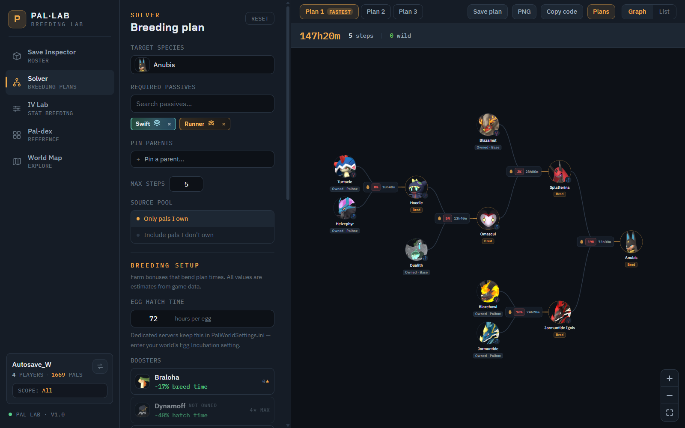

# Smitty's ATLAS

**Advanced Tracking, Location, Analysis & Statistics.**

Smitty's ATLAS is a Palworld companion and save-analysis application. It reads
your actual Palworld save and solves optimal breeding paths from the pals you
already own - accounting for passives, IVs, cakes, boosters, and time estimates
- so you get a concrete, do-this-next plan instead of a generic breeding chart.
Around the solver it wraps a full pal-dex, a world map with fog-of-war
reconstructed from your save, a palbox inspector, and an IV lab. Your save is
opened **read-only**; ATLAS never writes Palworld save files.

| Field | Value |
|---|---|
| Product | Smitty's ATLAS |
| Expansion | Advanced Tracking, Location, Analysis & Statistics |
| Current version | 0.1.0 |
| Repository | <https://github.com/Smitty1202/ATLAS> |
| Imported baseline | Pal Lab v1.10.1 (`e21ec37f643e2ca913cbf2de4f5898bc5fef70d5`) |

ATLAS is derived from **Pal Lab** by **Wire15** and continues development under
the terms of the MIT License. The original Pal Lab MIT attribution remains in
[`LICENSE`](LICENSE). Wire15 does not endorse, maintain, support, or otherwise
take responsibility for ATLAS.

Run ATLAS as a **Windows desktop app** with a live save watcher, or build the
same UI as a browser app. The web deployment target for ATLAS is
[`atlas.pages.dev`](https://atlas.pages.dev).

## Screenshots

| Solver | Palbox |
|---|---|
|  |  |

| World map | Pal-dex |
|---|---|
|  |  |

## Features

**Breeding solver**
- Optimal breeding paths from the pals you own, factoring passives, IVs, cakes,
  boosters, and time estimates. Probability model validated against palcalc's
  numeric test oracles.
- **Plan graph** (pannable/zoomable breeding-bracket flowchart) or **list**
  view, with rich per-step hover cards (odds, expected eggs, time, IV gates).
- **Multi-target queue** - plan several goals at once; later targets reuse the
  bred pals from earlier plans.
- Share and revisit: **PNG export**, copyable **plan codes**, and a **history**
  drawer of past solves.
- **No-path diagnostics** - when a target is unreachable, it tells you why
  instead of failing silently.
- **Surgery-table + gender-reverser cost options** - let the solver relax
  gender constraints via terminal implants; special lottery-tier passives
  (World-Tree, Rainbow) are correctly refused, and exact plans still win ties.
- **Honest mutations card** - mutations are ~1%/egg (code-verified), but the
  outcome pools are not publicly decoded, so ATLAS says so rather than
  inventing odds.

**Save Inspector** - party, palbox, dimensional storage, global storage, and
cages, scoped per player.

**IV Lab** - inspect and compare individual values across your pals, and breed
for stat thresholds with best-donor rankings, cake floors, and the same no-path
diagnostics and session persistence as the solver.

**Pal-dex**
- Full species reference with **reverse breeding** (which parents produce a
  given child), drops, moves, active/partner skills, and deep filters.
- **Partner-skills tab** - all 299 partner skills with per-rank values.
- **Collection mode** - annotates each species as owned, breedable-in-k-steps
  (BFS min-steps reachability), or catch-only, with a **"breed missing"** queue.

**World Map** - fast-travel points, effigies, alphas, bounties, towers, and
bases, plus **spawn search**; fog-of-war is reconstructed from your save.

**Plan tracking (desktop)** - saved plans auto-check their steps as you breed
in-game: node status badges, progress %, and stale-parent warnings driven by the
live save watcher.

**Breeding setup** - boosters (auto-detected at your real condensation rank),
cakes, lab research (incubation acceleration), and egg-hatch time scanned from
your world options, all composing into the solver's effort math.

## Desktop vs Web

Both run the same Rust solver - the desktop app natively, the web app compiled
to WebAssembly and driven through a Web Worker. The differences:

| | Desktop (Windows) | Web ([atlas.pages.dev](https://atlas.pages.dev)) |
|---|---|---|
| Install | Installer from [GitHub Releases](https://github.com/Smitty1202/ATLAS/releases) when published | None - open the link |
| Save loading | Auto-detect, or point at your save folder | Drag-drop or folder picker |
| **Live save watcher** | Supported: auto-refresh + plan tracking | Not available |
| Privacy | Local app | Parsed 100% client-side - your save never leaves your device |
| Save remembrance | Recent-saves profiles | Restore on revisit in all browsers (live folder handle on Chromium, plus a universal IndexedDB byte snapshot) |

On the web, Chromium blocks folder pickers inside `AppData` - use drag-drop or
the classic-dialog escape hatch instead. ATLAS offers both and remembers your
picker location.

## Getting Started

### Web

Open **[atlas.pages.dev](https://atlas.pages.dev)** once the ATLAS web
deployment is available and drop your world save folder onto the page (see the
save-location note below). Nothing is uploaded; your save is parsed in the
browser. Revisit later and click **Restore** to reload the last save.

### Desktop

1. Download the latest **installer** or **portable ZIP** from the
   [ATLAS Releases](https://github.com/Smitty1202/ATLAS/releases) page once a
   release is published.
2. Launch Smitty's ATLAS and point it at your Palworld save, or let it
   auto-detect the save.

**SmartScreen note:** ATLAS is an unsigned community build, so Windows
SmartScreen may warn on first run. Click **More info -> Run anyway**. Release
builds can include a **VirusTotal** link so you can verify the binary yourself.

### Where is my save?

Palworld world saves live in a folder like:

```text
%LOCALAPPDATA%\Pal\Saved\SaveGames\<steam-id>\<world-id>\
```

Point the desktop app at it, or drop that world folder onto the web app.

### Supported saves

| Save type | Status |
|---|---|
| Steam (local co-op) | Supported |
| Dedicated server (local files) | Supported |
| Dedicated server (remote, SFTP) | Built in - live over SSH (desktop) |
| Xbox / Game Pass (PC) | Built in - no conversion needed |

**Xbox / Game Pass:** desktop app -> **Xbox / Game Pass** button on the load
screen - it finds the Game Pass save store on your PC and reads it directly
(read-only, nothing is written). On the web app, drop the store folder itself:

```text
%LOCALAPPDATA%\Packages\PocketpairInc.Palworld_ad4psfrxyesvt\SystemAppData\wgs
```

Chunked (CNK) saves are decoded natively. Xbox **console** saves must still
reach your PC first by opening the world once in the PC Game Pass app so it
syncs.

**Dedicated servers over SFTP:** desktop app -> **Dedicated server (SFTP)**
button on the load screen. ATLAS connects over SSH, scans for worlds, and loads
yours live - then polls for changes every 60s so the roster stays current while
you play. Read-only: nothing is ever written to the server. Password or key-file
auth; the host fingerprint is pinned on first connect and passwords are never
stored unless you explicitly opt into the OS credential vault.

## What's New

The current ATLAS development version is **0.1.0**. This slice establishes the
ATLAS product identity, independent version history, and update checks against
`Smitty1202/ATLAS`.

Older entries in [`CHANGELOG.md`](CHANGELOG.md) are inherited Pal Lab release
history from the imported upstream baseline and remain historically accurate.

## Building From Source

Prerequisites: **Rust (stable)** and **[Bun](https://bun.sh)**.

```sh
# Rust workspace tests (solver, save parser, data model)
cargo test

# Frontend tests and production bundle
cd app
bun install
bun test
bun run build

# Build the desktop app
bun run tauri build
```

## License

- Smitty's ATLAS is distributed under the **MIT License** - see
  [`LICENSE`](LICENSE).
- ATLAS is derived from Pal Lab by Wire15. The inherited MIT notice, including
  `Copyright (c) 2026 Wire15`, remains intact and covers inherited Pal Lab code.
- The **`pal-data`** and **`pal-solver`** crates each also carry their own MIT
  `LICENSE` for standalone reuse. Full third-party attribution is in
  [`THIRD-PARTY-NOTICES.md`](THIRD-PARTY-NOTICES.md).

## Credits

- **[Wire15/Pal Lab](https://github.com/Wire15/pal-lab)** - original upstream
  application imported as the ATLAS baseline under the MIT License.
- **[tylercamp/palcalc](https://github.com/tylercamp/palcalc)** - pioneered the
  save-aware Palworld breeding-planner niche, and provides the MIT-licensed
  breeding data files and probability test oracles ATLAS builds on.
- **[oozextract](https://github.com/lvlvllvlvllvlvl/oozextract)** - the
  MIT-licensed pure-Rust Oodle Kraken decompressor that reads compressed save
  payloads.
- **[cheahjs/palworld-save-tools](https://github.com/cheahjs/palworld-save-tools)**
  - the reference documentation for the GVAS / `Level.sav` binary format.
- **[Pocketpair, Inc.](https://www.pocketpair.jp/)** - for Palworld.

See [`THIRD-PARTY-NOTICES.md`](THIRD-PARTY-NOTICES.md) for full attribution and
license texts.

## Disclaimer

Unofficial fan tool. Palworld is © Pocketpair, Inc. Not affiliated with or
endorsed by Pocketpair.

## Support

If ATLAS is useful, **star the repo** and file bugs or requests via
[GitHub Issues](https://github.com/Smitty1202/ATLAS/issues).
